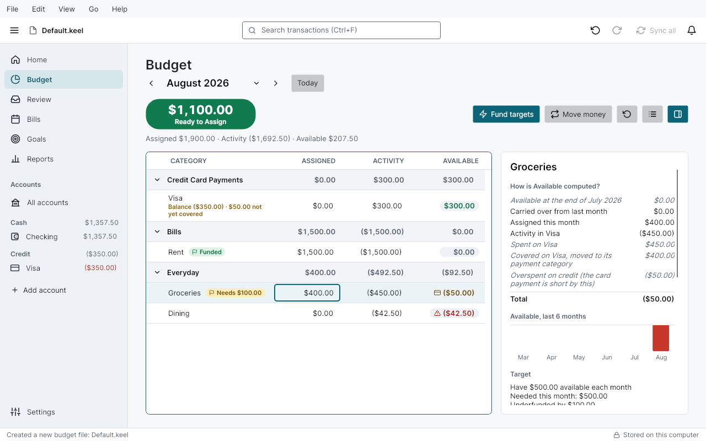
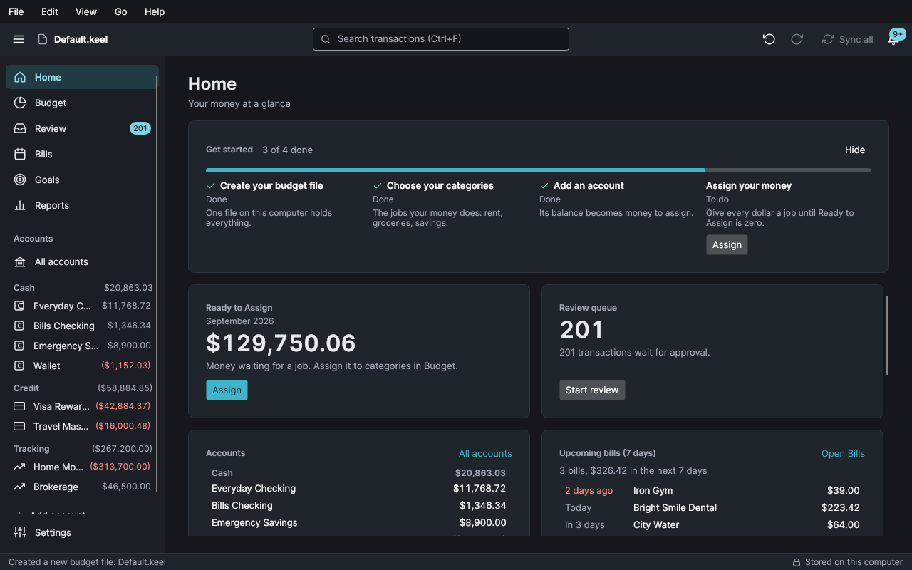
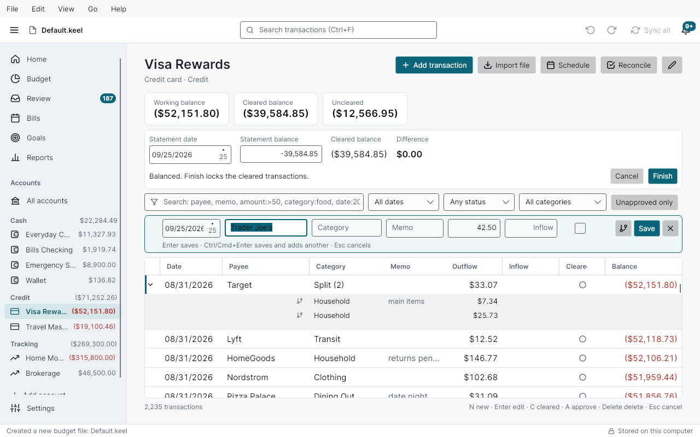
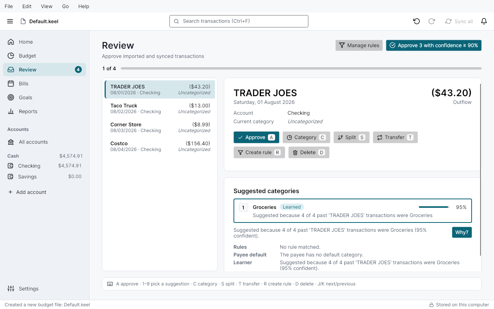
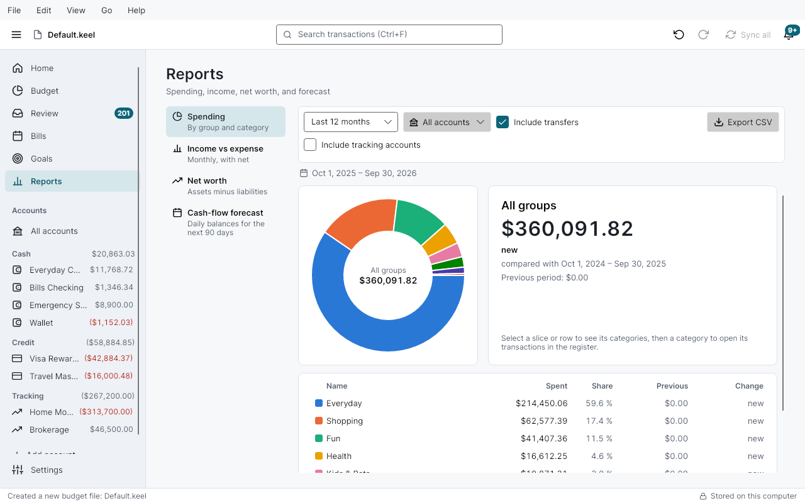
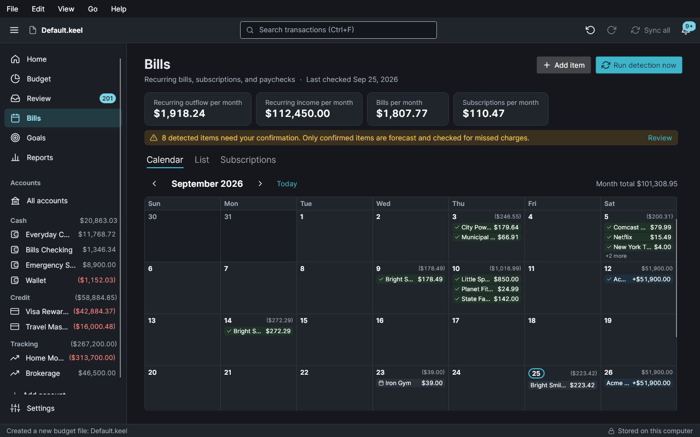
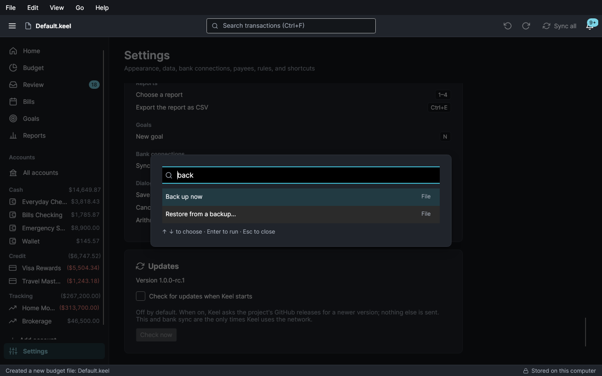
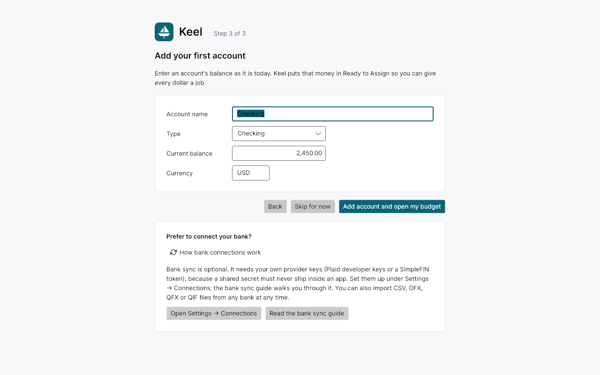

# Keel

Keel is a native desktop app for personal finance on Windows, macOS and Linux. It combines
zero-based envelope budgeting (give every dollar a job, with targets, credit cards and rollover done
right) with the full picture of your money: net worth, recurring bills and subscriptions, and a
90-day cash-flow forecast.

Everything lives in **one SQLite file on your computer**. Keel works offline, needs no account and
sends no telemetry. Manual entry and file import (CSV, OFX, QFX, QIF) are first-class; bank sync
through Plaid or SimpleFIN is optional and uses your own keys.



| | |
|---|---|
|  |  |
|  |  |
|  |  |
|  | |

## What it does

- **Envelope budget**: Ready to Assign, Assigned, Activity and Available per category and month;
  targets, quick assign, move money (keyboard or drag), credit-card payment categories, overspending
  that rolls over correctly. Every number can show how it was computed.
- **Accounts and registers**: checking, savings, cash, credit cards and tracking accounts
  (investments, property, loans); fast registers with 100,000 transactions, splits, transfers,
  reconciliation, search, and undo for everything.
- **Import** bank files with duplicate detection that makes re-importing the same file safe, and
  transfer matching across accounts.
- **Review and rules**: new transactions wait for approval with suggested categories from your rules
  and a local learner that explains itself; rules can rename, categorize, split and more.
- **Bills and forecast**: recurring bills, subscriptions and paychecks are detected and shown on a
  calendar, with price-change and missed-charge alerts, scheduled transactions, and a 90-day forecast.
- **Reports and goals**: spending, income vs expense, net worth and forecast reports, every chart
  clickable down to the transactions; savings goals with progress and projections.
- **Your data, your file**: daily verified backups, restore, moving the file anywhere (for example a
  synced folder), an integrity check, and a diagnostic bundle with no personal data.
- **Keyboard first**: `Ctrl/⌘+K` command palette, shortcuts on every screen, screen-reader names on
  every control, WCAG AA contrast in light and dark themes, accent colors, compact density, reduced
  motion.

## Download

Installers are published on the
[releases page](https://github.com/lucasbarrett1999/Avalonia-Finance-App/releases):

| System | Package |
|---|---|
| Windows 10/11 (x64, Arm) | `Keel-win-x64-Setup.exe`, `Keel-win-arm64-Setup.exe` (per-user install, no admin) |
| macOS 13+ (Apple silicon, Intel) | `Keel-<version>-osx-arm64.dmg`, `Keel-<version>-osx-x64.dmg` (also a `.pkg`) |
| Ubuntu 22.04+ / Debian 12+ | `keel_<version>_amd64.deb` |
| Other Linux (x64) | `Keel-linux-x64.AppImage` |

The current version is **1.0.0**. Builds may be unsigned; the
[getting started guide](docs/user-guide/getting-started.md) explains the first-launch warnings.
Automatic update checks are off by default (Settings → Updates).

## User guide

Start with [docs/user-guide](docs/user-guide/README.md): getting started, budgeting in Keel,
importing, review and rules, bills and scheduling, reports and goals, bank sync, backups and the data
file, and keyboard shortcuts.

## Build, run and test

Install the [.NET 10 SDK](https://dotnet.microsoft.com/download) (`global.json` pins the major
version).

```bash
dotnet restore Keel.sln
dotnet build Keel.sln -c Release          # 0 warnings expected
dotnet test Keel.sln -m:1                 # domain, database and headless UI tests
dotnet format Keel.sln --verify-no-changes
dotnet run --project src/Keel.Desktop     # start the app
```

Render every screen to PNG (light and dark) without a display:

```bash
KEEL_SCREENSHOT_DIR=/tmp/keel-shots dotnet test tests/Keel.Desktop.Tests --filter RenderingTests
```

Build installers (details in [ADR 0083](docs/decisions/0083-packaging-and-updates.md)):

```bash
build/package.sh          # Linux: AppImage and .deb (needs squashfs-tools); macOS: .pkg, zip and .dmg
pwsh build/package.ps1    # Windows: Setup.exe and portable zip for x64 and arm64
```

Pushing a tag `v<version>` that matches `Directory.Build.props` runs
`.github/workflows/release.yml`, which tests, packages on all three systems and publishes a GitHub
release.

## Where your data lives

| System | Data folder |
|---|---|
| Windows | `%APPDATA%\Keel` |
| macOS | `~/Library/Application Support/Keel` |
| Linux | `~/.local/share/keel` (or `$XDG_DATA_HOME/keel`) |

It holds `settings.json`, `logs/`, and `budgets/` with your `.keel` files and `backups/`. You can
keep a budget file anywhere; Keel remembers where.

## Repository layout

| Path | What it is |
|---|---|
| `src/Keel.Domain` | Money, entities, the budget math (PRD 6.4), rules, learner, import, recurring detection and forecast engines. No dependencies. |
| `src/Keel.Application` | Service interfaces, DTOs and messages. |
| `src/Keel.Infrastructure` | EF Core + SQLite, services, file parsers, backups, bank providers, OS secret stores. |
| `src/Keel.Desktop` | The Avalonia app. |
| `tests/` | Unit, database, headless UI and rendering tests; benchmarks. |
| `build/` | Packaging scripts and icon generation. |
| `docs/` | [PRD](docs/PRD.md), [user guide](docs/user-guide/README.md), [QA checklist](docs/qa-checklist.md), [decisions](docs/decisions/). |

Contributor and agent notes are in [`CLAUDE.md`](CLAUDE.md); release notes in
[`CHANGELOG.md`](CHANGELOG.md).

## Privacy

Keel sends no telemetry. It connects to the network only to sync with a bank provider you set up and,
if you turn it on, to check for updates. Bank keys and tokens stay in your operating system's secret
store.

## License

Not chosen yet; the PRD assumes MIT (PRD 14, open question 4).
